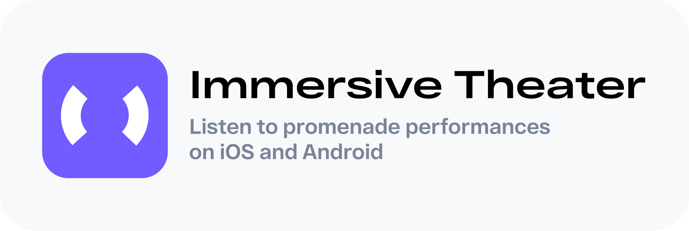

Note: Flutter project is in active development as part of internship at Student Labs & Effective.

A working platform in the form of a mobile application for the Omsk Actor's House. The application will implement the ability to listen to the performance in Omsk in open space, as well as outside it.


## Getting Started
Clone the repo and follow these steps to setup the project.

### Environment
Dart 2.19.2 or greater, but lesser 3.0.0 and Flutter 3 or greater is required.

[Follow this guide to setup your flutter environment](https://docs.flutter.dev/get-started/install) based on your platform.

### Flutter
First and foremost make sure you have Flutter 3 setup on your system. 
You can check the version by running
```bash
flutter --version
```
You should see output similar to this. Check if the version is `3.x.x`.
```bash
Flutter 3.7.5 • channel stable • https://github.com/flutter/flutter.git
Framework • revision c07f788888 (6 months ago) • 2023-02-22 17:52:33 -0600
Engine • revision 0f359063c4
Tools • Dart 2.19.2 • DevTools 2.20.1
```
Run this command to update flutter to the latest version
```bash
flutter upgrade
```
## Build 

### iOS

Run this command to build ipa
```bash
flutter build ipa --no-tree-shake-icons
```

### Android

Run this command to build apk
```bash
flutter build apk --no-tree-shake-icons
```


## Major Dependencies

* Network - [Dio](https://pub.dev/packages/dio)
* Maps - [Yandex MapKit](https://pub.dev/packages/yandex_mapkit)
* State Management - [Flutter Bloc](https://pub.dev/packages/flutter_bloc) 
* Playback Audio - [Just Audio](https://pub.dev/packages/just_audio)
* Custom Bottom Sheet [Sliding Up Panel](https://pub.dev/documentation/sliding_up_panel/latest/)
* Detecting geolocation - [Geolocator](https://pub.dev/packages/geolocator)
* Stream extensions - [RxDart](https://pub.dev/packages/rxdart)


## Features 

- Onboarding
- Phone Number Authentification with [Firebase](https://firebase.flutter.dev/docs/overview/)
- Maps on main screen with control points of each performance.
- Listening performances in genre promenade with user geolocation update.
- Listening performances at home.


## Demo 

### Onboarding screens.

Info about this application.

 

### Login and verification screens.

Phone number authentification with test data.

 


### Main Screen.

The screen contains two parts: list of all performances and list of bought tickets. Placemarks on the map contain info about control points of performances route.

 

### Detailed Performance Screen.

Screeen shows detailed information about performance: description, duration, location of 1st chapter, images, chapters and route of performance.


 


### Performance Mode

|                         Chapter overview            |                    Chapter switch example                   |
|:----------------------------------------------------------:|:------------------------------------------------------------:|
|   |  |

### First-run Ondoarding 
 


### Onboarding before performance and route planning

|                         Onboarding -> performance mode            |                    Route planning                   |
|:----------------------------------------------------------:|:------------------------------------------------------------:|
|   |  |

